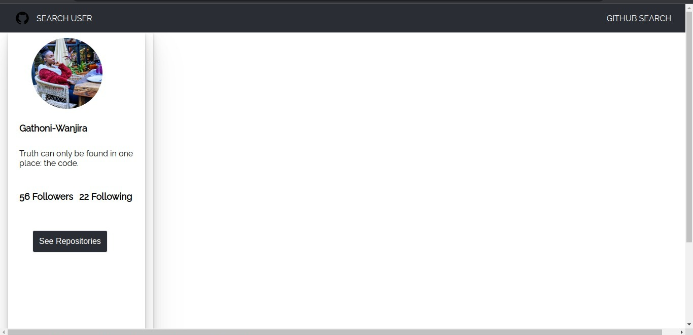
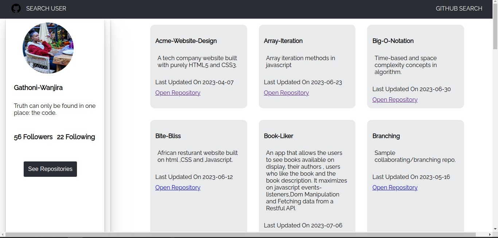

# GITHUB-SEARCH APP

## DESCRIPTION.

Github Search Username is a web application where users can search github users and view their details.It allows users to see the repositories of the searched Github users and provides a live link to the specific repositories directly to Github.

## SET-UP REQUIREMENTS.

- Git.
- Web-browser of your choice.
- Github
- Node.js (https://nodejs.org/)
- Github ApiKey

## SET-UP /INSTALLATIONS.

- Copy the github repository url
- Clone to your computer
- Open terminal and navigate to the directory of the project you just cloned to your computer
- Run the following command to install all the dependencies

```
npm install
```

- Generate Github ApiKey(https://docs.github.com/en/github/authenticating-to-github/keeping-your-account-and-data-secure/creating-a-personal-access-token)

## TECHNOLOGIES USED. 
---

The following languages have been used on this project:

- HTML
- CSS
- Javascript

- Live link to view the project <a href="https://gathoni-wanjira.github.io/Github-Search/">View Github Search App</a>

## SCREENSHOTS FROM THE APP. 
---

- HOMEPAGE.
  

- USER-FOUND GITHUB DETAILS. 
  
  

- GITHUB SEARCH USER REPOSITORIES FOUND.

  


- GITHUB SEARCH USER REPOSITORIES FOUND.(cont.)
  


 - ERROR MESSAGE IF GITHUB USER IS NOT FOUND.
  

- ERROR MESSAGE IF USER REPOSITORY IS NOT FOUND.
  


## KNOWN BUGS.
--- 

- So far so good there are no bugs related to this project.

## SUPPORT & CONTACT DETAILS.  
---

To make a contribution to the code used or any suggestions you can click on the contact link and email me your suggestions.

- Email: janetgathoni910@gmail.com

## AUTHOR. 
---

- [Gathoni Wanjira](https://github.com/Gathoni-Wanjira)

